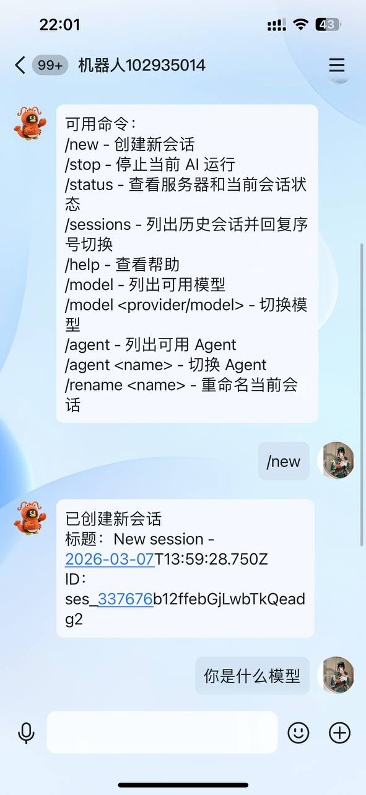
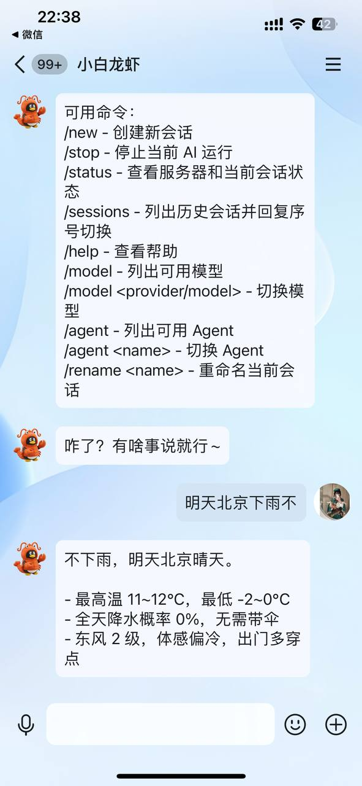

<div align="center">

# OpenCode QQ Bot

通过 QQ 机器人与 OpenCode AI 编程助手对话。

[](https://www.npmjs.com/package/opencode-qq-bot)
[](./LICENSE)
[](https://bot.q.qq.com/wiki/)
[](https://opencode.ai)
[](https://bun.sh)
[](https://www.typescriptlang.org/)

</div>

---

龙虾都能用了,那opencode也要接上

<div align="center">



</div>

---

## 功能特性

- **QQ 群聊 + 私聊** - @机器人 或直接私信，两种方式都支持
- **内嵌 OpenCode** - 自动启动 opencode serve，无需手动管理进程
- **会话管理** - 每用户独立会话，支持新建、切换、重命名
- **模型切换** - 随时切换 AI 模型和 Agent 模式
- **交互引导** - 首次运行自动引导配置，零门槛启动
- **命令系统** - 10 个内置命令覆盖常用操作

---

## 快速开始

### 前置条件

- [Bun](https://bun.sh) >= 1.0
- [OpenCode](https://opencode.ai) 已安装
- QQ 机器人的 AppID 和 AppSecret（下文有获取教程）

### 安装

```bash
bun install -g opencode-qq-bot
```

### 启动

```bash
openqq
```

首次运行会自动引导你填写 QQ 机器人凭证：

```
首次运行，需要配置 QQ 机器人凭证
(从 https://q.qq.com 机器人管理 -> 开发设置 获取)

QQ App ID: 1029******
QQ App Secret: ********
配置已保存到 ~/.openqq/.env
```

配置保存后，以后在任意目录直接 `openqq` 即可启动。

---

## 连接外部 OpenCode

默认情况下，`openqq` 会自动在进程内启动 opencode serve。

如果你已经单独运行了 opencode serve（比如同时在用 TUI），设置环境变量连接外部实例：

```bash
# 方式 1: 环境变量
OPENCODE_BASE_URL=http://localhost:4096 openqq

# 方式 2: 写入 ~/.openqq/.env
echo "OPENCODE_BASE_URL=http://localhost:4096" >> ~/.openqq/.env
```

---

## 命令列表

在 QQ 对话中发送以下命令：

| 命令 | 功能 |
|------|------|
| `/new` | 创建新会话 |
| `/stop` | 停止当前 AI 运行 |
| `/status` | 查看服务器和当前会话状态 |
| `/sessions` | 列出历史会话，回复序号切换 |
| `/help` | 查看帮助 |
| `/model` | 列出可用模型，回复序号切换 |
| `/model <provider/model>` | 直接切换到指定模型 |
| `/agent` | 列出可用 Agent |
| `/agent <name>` | 切换 Agent（如 code / ask） |
| `/rename <name>` | 重命名当前会话 |

首次 @机器人 或私聊时，Bot 会自动发送命令帮助。

也支持使用反斜杠前缀，例如 `\sessions`。

当 `/sessions` 列出历史会话后，直接回复数字会优先执行会话切换，不会再被误判成权限确认指令。

---

## QQ 确认与权限交互

当 OpenCode 先要求人工确认时，QQ 会显示：

```text
OpenCode 需要操作确认
Confirm you want me to ...
回复 1 确认继续 / 3 取消
```

当 OpenCode 需要权限确认时，QQ 会显示：

```text
OpenCode 需要权限确认
操作：...
路径：...
下一步：回复 1 允许一次 / 2 总是允许 / 3 拒绝
```

机器人会尽量从权限事件里提取真实操作和路径，避免出现 `undefined`。

---

## 创建 QQ 机器人

### 1. 注册 QQ 开放平台

前往 [QQ 开放平台](https://q.qq.com/qqbot/openclaw/) 注册账号。


### 2. 创建机器人

登录后进入「QQ 机器人」页面，点击「创建机器人」。

创建完成后进入机器人管理页面，在「开发设置」中获取：
- **AppID** - 机器人唯一标识
- **AppSecret** - 点击「重新生成」获取（不会明文存储，首次需要生成）

> 请妥善保管 AppSecret，不要泄露。

### 3. 沙箱配置

在机器人的「开发管理」->「沙箱配置」中：

1. 添加测试成员（填入 QQ 号）
2. 配置私聊：选择「在消息列表中配置」
3. 用测试成员的 QQ 扫码添加机器人

> 机器人不需要发布上线，沙箱模式下就能正常使用。

### 4. 群聊使用

要在群里使用，需要把机器人拉入群聊：

1. 在「开发管理」->「沙箱配置」中开启群聊支持
2. 在群设置中搜索并添加机器人
3. 群内 @机器人 发送消息

---

## 配置说明

所有配置通过环境变量或 `~/.openqq/.env` 文件管理：

| 变量 | 必填 | 默认值 | 说明 |
|------|------|--------|------|
| `QQ_APP_ID` | 是 | - | QQ 机器人 AppID |
| `QQ_APP_SECRET` | 是 | - | QQ 机器人 AppSecret |
| `QQ_SANDBOX` | 否 | `false` | 是否使用沙箱环境 |
| `OPENCODE_BASE_URL` | 否 | (自动启动) | 外部 opencode serve 地址 |
| `ALLOWED_USERS` | 否 | (不限制) | 允许使用的 QQ 用户 ID，逗号分隔 |
| `MAX_REPLY_LENGTH` | 否 | `3000` | 单条回复最大字符数 |

---

## 项目结构

```
opencode_qq_bot/
├── bin/openqq.js          # CLI 入口
├── src/
│   ├── index.ts           # 启动编排 + 优雅关闭
│   ├── config.ts          # 配置加载 + 交互引导
│   ├── bridge.ts          # 核心桥接: QQ <-> OpenCode
│   ├── commands.ts        # 命令系统
│   ├── qq/
│   │   ├── api.ts         # QQ REST API 封装
│   │   ├── gateway.ts     # WebSocket 状态机
│   │   ├── sender.ts      # 消息格式化 + 发送
│   │   └── types.ts       # QQ 类型定义
│   └── opencode/
│       ├── client.ts      # OpenCode SDK 封装
│       ├── events.ts      # SSE 事件路由
│       └── sessions.ts    # 会话管理
└── .env.example
```

---

## 工作原理

```
QQ 用户 @机器人 发消息
       |
       v
  QQ Gateway (WebSocket)
       |
       v
  Bridge 桥接层
       |
       +---> /命令 或 \命令 ---> 命令处理 ---> 回复
       |
       +---> 数字回复且存在待切换会话 ---> 会话切换 ---> 回复
       |
       +---> 数字回复且存在待确认/待授权 ---> 继续确认或权限决策
       |
       +---> 普通消息
               |
               v
         OpenCode SDK
         promptAsync()
               |
               v
         SSE 事件流
               |
               +---> message.part.updated ---> 可按阶段回推进度到 QQ
               |
               +---> permission.asked ---> 发送权限确认到 QQ
               |
               +---> assistant 文本确认 ---> 发送操作确认到 QQ
               |
               +---> session.idle ---> 发送最终回复到 QQ
```

- 使用 Fire-and-Forget 模式：`promptAsync()` 不阻塞，通过 SSE 事件流异步收集回复
- 全局一个 SSE 连接，EventRouter 按 sessionId 分发到各用户
- 长任务会先发送“正在处理中”，并可在处理中回推阶段性进度
- 如果中途出现确认或权限请求，QQ 可以直接回复数字继续流程
- `session.idle` 时再发送最终结果，避免把普通数字回复误发给 AI

---

##
尝试强化opencode服务器，避免询问崩溃或5分钟超时
## 致谢

- [OpenCode](https://opencode.ai) - AI 编程助手
- [sliverp/qqbot](https://github.com/sliverp/qqbot) - QQ Bot API 封装参考
- [grinev/opencode-telegram-bot](https://github.com/grinev/opencode-telegram-bot) - 架构参考

## License

MIT
